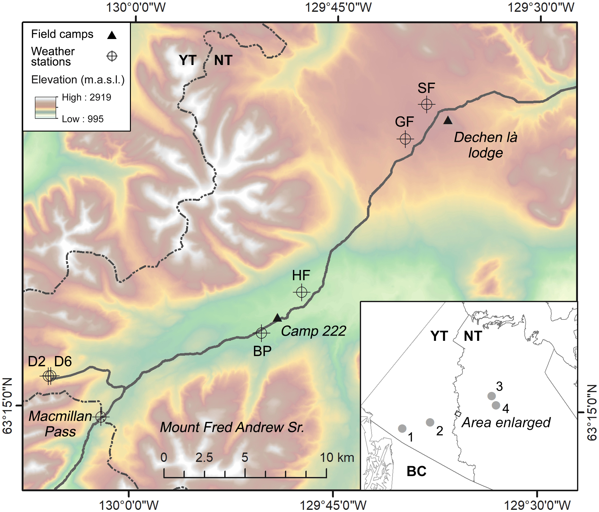
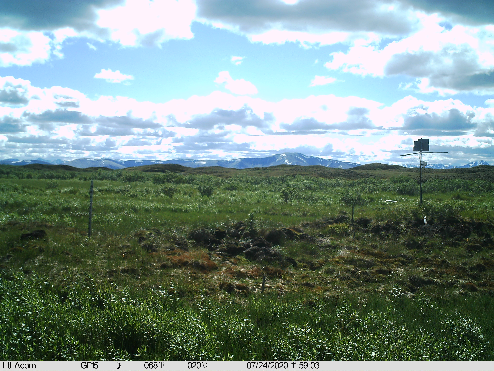
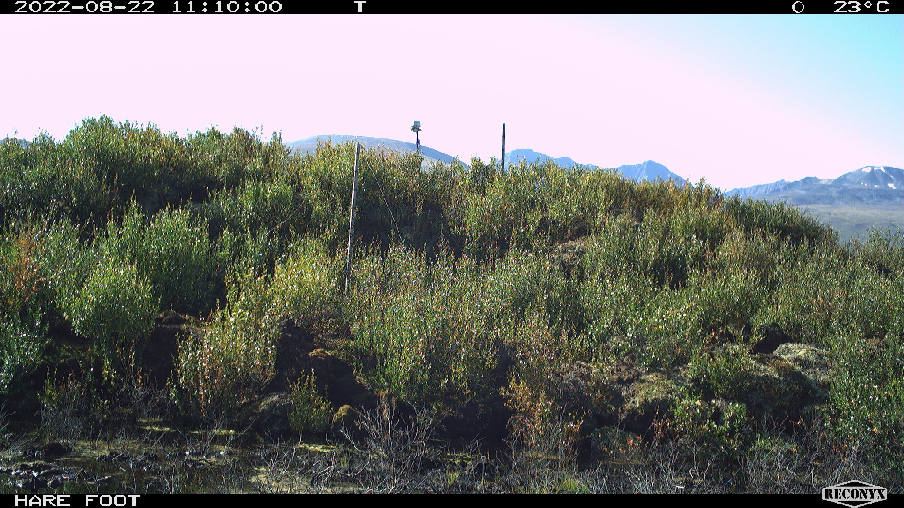
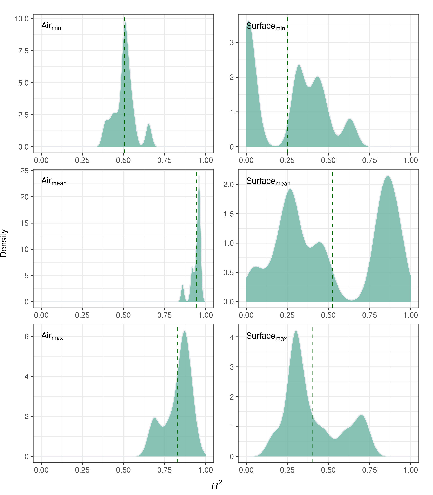
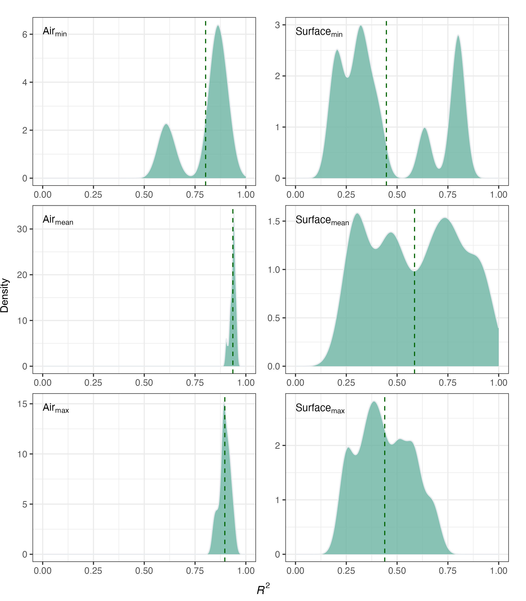
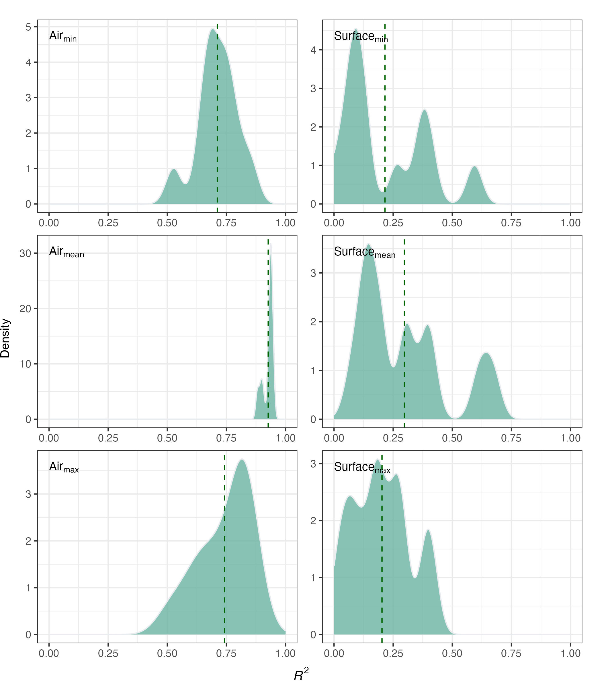
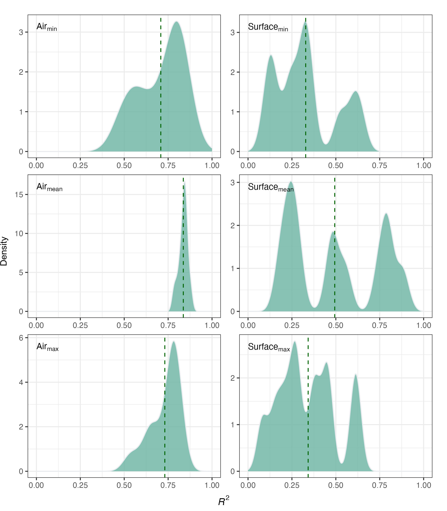
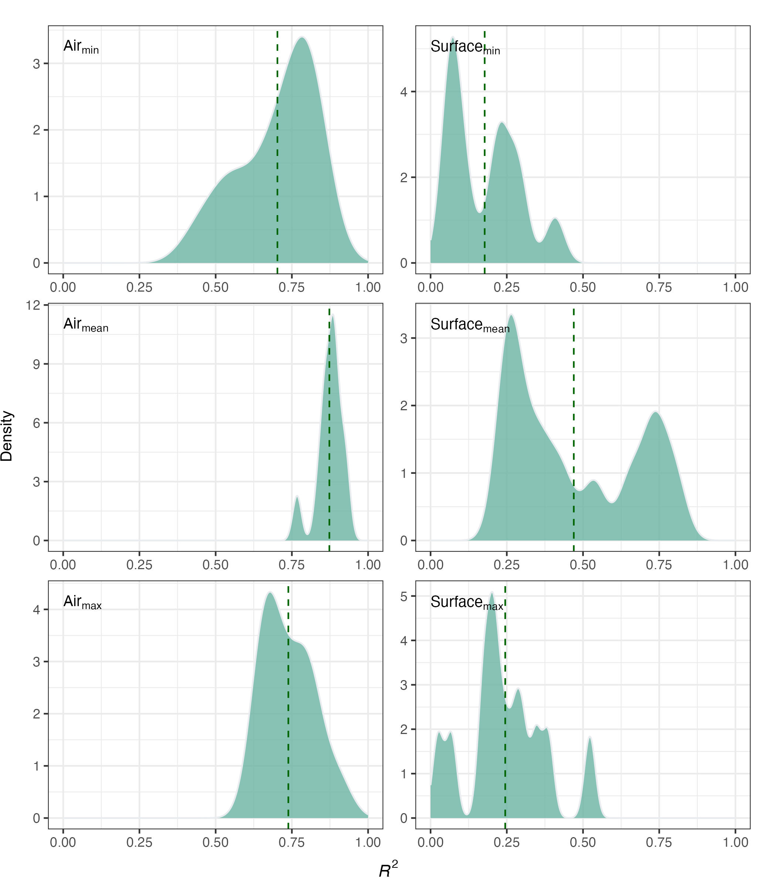
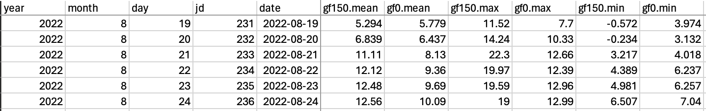
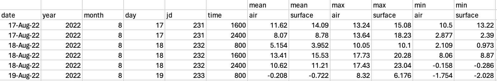

```{r setup, include=FALSE}
## This script is used to generate the GNWT report each year

## Load libraries
library(bookdown)
library(tidyverse)
library(knitr)
library(officedown)
library(officer)
library(kableExtra)
library(flextable)
library(ftExtra)
library(formattable)

# opts_chunk$set(echo = FALSE)

```

```{r, include=FALSE}
## Define variables to be presented in the text
field_year <- 2023
miss_temp_min <- 28
miss_temp_max <- 100
miss_ppt_min <- 99
miss_ppt_max <- 100
min_r2 <- "0.002"
max_r2 <- "0.952"
mean_r2 <- "0.344"
```

# Mackenzie Mountains Climate Data Archiving Project
Prepared 24 April 2024 by Steven Mamet^1,2^  
*^1^Department of Soil Science, College of Agriculture and Bioresources, University of Saskatchewan, Saskatoon, SK*  
*And*  
*^2^Churchill Northern Studies Centre, Churchill Manitoba*  

# Background  

During World War II the Canol Pipeline was established to transport oil from Norman Wells to Whitehorse. The pipeline was abandoned in 1945 with oil in-situ resulting in environmental degradation as the pipeline degraded. Dr. Peter Kershaw (University of Alberta) undertook long term monitoring of the recovery and change of ecosystems to Canol Pipeline as part of his Ph.D. Research @RN2558. He continued monitoring the recovery of the and established climate stations in the 1990s.  

After Dr. Kershaw retired from the University of Alberta in 2011 and from Canol research in 2013, Dr. Steven Mamet (Adjunct Professor, University of Saskatchewan) continued the long-term research of ecosystem change including @RN5191.  

The purpose of this project is to inventory climate data from northern climate stations operated by Dr. Steven Mamet of the University of Saskatchewan and the Churchill Northern Studies Centre. The Government of the NWT plans to archive this data in a climate database that they are developing.  

# Results  

Metadata including location, site description, observation period, observation and measurement frequency for six climate stations operated by Drs. Kershaw and Mamet is provided in Tables 1–2 (also see Figures 1–7). Variables measured include air temperature, ground surface temperature, rain, and snow. Air temperature was measured at approximately 1.5 m height using the custom-built radiation shield (Figure 2).  

Ground surface temperature was measured at 0 cm depth. Liquid precipitation was measured using a Campbell Scientific TB44 MM tipping bucket rain gauge that measures rainfall in 0.2 mm increments. Snow was measured using two LTL Acorn 5210a cameras programmed to obtain daily midday photos and four snow stakes (Figures 8, 9). Recent failures of the LTL cameras have led to their replacement with Reconyx HyperFire 2™ Covert IR trail cameras, though there currently no new snow data to report for 2023. Data timestamps are Mountain Standard Time (MST, UTC-7).  

In August 2022, we deployed an OTT Pluvio^2^ weighing rain gauge at the Beaver Pond site to measure daily and hourly precipitation.  

Climate station data is included in the attached Excel file MM_compiled_`r field_year`.xlsx  

# Station Metadata  

See ‘Metadata’ in accompanying spreadsheet.  

# Site photos  

```{r, echo=FALSE,  fig.cap="Figure 1. The Beaver Pond weather station in August 2022.", out.width="12cm", out.height="16cm"}
knitr::include_graphics("GNWT_Figure01.jpeg")
```

`r run_pagebreak()`

```{r, echo=FALSE,  fig.cap="Figure 2. The Hare Foot weather station in August 2015 (top of the palsa on the right).", out.width="15cm"}
knitr::include_graphics("GNWT_Figure02.jpeg")
```

`r run_pagebreak()`

```{r, echo=FALSE,  fig.cap="Figure 3. The Dale Creek #6 weather station in August 2021.", out.width="12cm", out.height="16cm"}
knitr::include_graphics("GNWT_Figure03.jpeg")
```

`r run_pagebreak()`

```{r, echo=FALSE,  fig.cap="Figure 4. The Dale Creek #2 weather station in August 2023.", out.width="12cm", out.height="16cm"}
knitr::include_graphics("GNWT_Figure04.jpeg")
```

`r run_pagebreak()`

```{r, echo=FALSE,  fig.cap="Figure 5. The Goose Flats weather station in August 2023.", out.width="12cm", out.height="16cm"}
knitr::include_graphics("GNWT_Figure05.jpeg")
```

`r run_pagebreak()`

```{r, echo=FALSE,  fig.cap="Figure 6. The location where the Snow Fence weather station operated from 1994 to 2001. The photo was taken in August 2019.", out.width="15cm"}
knitr::include_graphics("GNWT_Figure06.jpeg")
```

`r run_pagebreak()`

```{r, echo=FALSE,  fig.cap="Figure 7. Locations of the weather stations and field camps along the Canol Heritage Trail. Inset map: 1: Whitehorse, 2: Ross River, 3: Norman Wells, 4: Tulita. Site names from west to east are: D2 = Dale Creek #2, D6 = Dale Creek #6, BP = Beaver Pond, HF = Hare Foot, GF = Goose Flats, and SF = Snow Fence.", out.width="15cm"}

```

`r run_pagebreak()`

```{r, echo=FALSE,  fig.cap="Figure 8. Example photo taken using the Acorn LTL 5210a camera mounted at the Goose Flats site. Snow depth was measured using snow stakes placed on the palsa lee (left) and top (attached to weather station; right).", out.width="15cm"}

```

`r run_pagebreak()`

```{r, echo=FALSE,  fig.cap="Figure 9. Example photo taken using the Reconyx HyperFire 2™ Covert IR trail camera mounted at the Hare Foot site. Snow depth was measured using snow stakes placed on the palsa lee (centre left) and top (to the right of the weather station on the palsa horizon).", out.width="15cm"}

```

`r run_pagebreak()`

# Missing values and data filling

There are missing values in the temperature, precipitation, and snow depth data. The temperature data ranges from `r miss_temp_min` to `r miss_temp_max`%% complete (Table 1), there is no new snow data, and precipitation data from `r miss_ppt_min` to `r miss_ppt_max`% (Table 2). Missing temperature values were filled with monthly multiple linear regression model temperature estimates using the Environment Canada (EC) Macmillan Pass daily data @RN6088 (covering the period 2022-2023). All data filling and analyses were completed in R v. 4.3.2 @RN6110.  

I started by filling mean air temperatures at site Hare Foot, and using both EC and the filled data in subsequent data fills at other sites. As the list of dependent variables grew, I used linear regression to choose the most predictive variables to fill the data at each site (see Table 1). Missing data were filled using transfer functions based on the regression coefficients from the linear regression. Below is an example of the linear regressions in R used to gap-fill monthly air temperatures:

```{r eval=FALSE}
#_____________________________________-----
# Fill the missing air temperatures ----

# Mean
macpass <- macpass %>%
  group_by(month) %>%
  nest() %>%
  mutate(filled = map(data, ~fill_missing_with_lm(.x, 
                                                  vars = c("bp150.mean", "hf150.mean", "d2150.mean", "d6150.mean", "gf150.mean", "sf150.mean"),
                                                  fill_var = "mean.150"))) %>%
  select(month, filled) %>%
  unnest(cols = c(filled)) %>% 
  arrange(date) %>% 
  mutate(month = as.integer(month(date))) %>% 
  ungroup()

# Min
macpass <- macpass %>%
  group_by(month) %>%
  nest() %>%
  mutate(filled = map(data, ~fill_missing_with_lm(.x, 
                                                  vars = c("bp150.min", "hf150.min", "d2150.min", "d6150.min", "gf150.min", "sf150.min"),
                                                  fill_var = "min.150"))) %>%
  select(month, filled) %>%
  unnest(cols = c(filled)) %>% 
  arrange(date) %>% 
  mutate(month = as.integer(month(date))) %>% 
  ungroup()

# Max
macpass <- macpass %>%
  group_by(month) %>%
  nest() %>%
  mutate(filled = map(data, ~fill_missing_with_lm(.x, 
                                                  vars = c("bp150.max", "hf150.max", "d2150.max", "d6150.max", "gf150.max", "sf150.max"),
                                                  fill_var = "max.150"))) %>%
  select(month, filled) %>%
  unnest(cols = c(filled)) %>% 
  arrange(date) %>% 
  mutate(month = as.integer(month(date))) %>% 
  ungroup()
```

A total of 360 regressions (5 sites x 6 variables [minimum, mean, and maximum air and ground surface temperatures] x 12 months) were used to fill the temperature data.
Model R^2^s ranged from `r min_r2` to `r max_r2` (Figures 10–14), with a mean of `r mean_r2`
The sub-daily (4 and/or 8 hr) temperature records were not gap filled. Both the filled and unfilled data are provided to GNWT.  

There are precipitation data available at two sites (BP, and GF). The quality of the GF data is questionable (e.g., there are long periods of consecutive days where there are zero values). I would recommend comparing these data to Macmillan Pass EC data to check for some overlap of measurements. BP is closest to the EC station (Figure 7; 4 and 12 km, respectively) and would be good candidates for this comparison.  

The snow data were collected using either LTL Acorn 5210a or Reconyx HyperFire 2™ Covert IR trail cameras mounted near the HF and GF weather stations. The cameras were programmed to take one photo each day at midday. Snow stakes with a 10 cm-interval graticule were mounted within the field of view of each camera to determine snow depth. Two stakes were placed at each site: one at the top of the palsa to measure snow in wind-exposed areas and one on the lee of each palsa to monitor wind deposited snow (Figures 8, 9). The HF palsa top is ~4.9 m above the surrounding landscape and the GF palsa is 2.2 m.  

Data were lost due to periodic animal damage and/or inclement weather obscuring the camera lens (e.g., snow deposition, riming). These missing values were previously filled using a combination of linear interpolation using the R package ‘zoo’ v. 1.8–12 @RN6089 and monthly multiple linear regression using neighbouring data sets. The camera at both sites failed in 2019 and new ones were deployed in 2022 and 2023 so the data are only current to 2019. GNWT has already been provided these data.  

<!-- A total of 40 regressions (2 sites x 2 snow stakes x 10 months [July and August were typically snow-free]) were used to fill the snow depth data. Model R2s ranged from 0.208 to 1.000 (Figure 16), with a mean of 0.762. -->
<!-- Examples of the daily and sub-daily temperature data with brief descriptions are provided in figures 17 and 18. Snow data examples are not included for brevity as the formats are similar to the temperature data. -->

```{r, echo = FALSE, include=FALSE}
names_list <- c("sf150.mean","sf0.mean","sf150.max","sf0.max","sf150.min","sf0.min","gf150.mean","gf0.mean"  ,"gf150.max","gf0.max","gf150.min","gf0.min","hf150.mean","hf0.mean","hf150.max" ,"hf0.max","hf150.min","hf0.min","bp150.mean","bp0.mean","bp150.max","bp0.max","bp150.min" ,"bp0.min","d2150.mean","d20.mean","d2150.max","d20.max","d2150.min","d20.min"   ,"d6150.mean","d60.mean","d6150.max","d60.max","d6150.min","d60.min")

tab1 <- readRDS("~/Desktop/Workspace/earthwatch/MacPass/Reports/Table01.rds")
names(tab1) <- c("Variable","No. values recorded","Total values (recorded + missing)","% complete") 
tab1 <- tab1 %>%
  slice(-c(1:6)) %>% 
  mutate(across(2:4, round, 1)) %>% 
  filter(Variable %in% names_list)
set_flextable_defaults(
  font.size = 10, padding = 3)
ft1 <- qflextable(tab1) %>% 
  set_caption(caption = as_paragraph(
    "Table 1. Record completion details prior to gap filling for the daily temperature records measured along the Canol Heritage Trail from 2022 to 2023"),
    style = "Table Caption") %>%
  hline_bottom() %>%
  # hline(i = c(1)) %>%
   footnote(i = 1, j = 2,
            value = as_paragraph("Variables are coded as Site, Measurement height (ground surface (0 cm) and 150 cm above ground), and minimum, mean, or maximum values. E.g., sf150.mean represents mean air temperatures at site Snow Fence (sf). gf = Goose Flats, hf = Hare Foot, bp = Beaver Pond, D6 = Dale Creek #6, and D2 = Dale Creek #2."),
           ref_symbols = "a",
           part = "header",
           inline = TRUE,
           sep = "")
```

```{r echo = FALSE}
ft1
```
`r run_pagebreak()`

```{r, echo = FALSE, include=FALSE}
tab2 <- tibble(
  Site = c("GF","BP"),
  `No. values recorded` = c(360,365),
  `Total values (recorded + missing)` = c(365,365),
  `% complete` = c("98.6%","100.0%")
)

set_flextable_defaults(
  font.size = 10, padding = 3)
ft2 <- qflextable(tab2) %>% 
  set_caption(caption = as_paragraph(
    "Table 2. Record completion details for the daily liquid precipitation records measured along the Canol Heritage Trail from 2022 to 2023."),
    style = "Table Caption") %>%
  hline_bottom()
```
```{r echo = FALSE}
ft2
```

```{r, echo=FALSE,  fig.cap="Figure 10. Density distributions of *R*^2^ from linear models used to fill missing values in the Beaver Pond site daily air (150 cm) and ground surface temperatures. The vertical dashed line indicates mean *R*^2^.", out.width="15cm"}

```

`r run_pagebreak()`

```{r, echo=FALSE,  fig.cap="Figure 11. Density distributions of *R*^2^ from linear models used to fill missing values in the Hare Foot site daily air (150 cm) and ground surface temperatures. The vertical dashed line indicates mean *R*^2^.", out.width="15cm"}

```

`r run_pagebreak()`

```{r, echo=FALSE,  fig.cap="Figure 12. Density distributions of *R*^2^ from linear models used to fill missing values in the Dale Creek #6 site daily air (150 cm) and ground surface temperatures. The vertical dashed line indicates mean *R*^2^.", out.width="15cm"}

```

`r run_pagebreak()`

```{r, echo=FALSE,  fig.cap="Figure 13. Density distributions of *R*^2^ from linear models used to fill missing values in the Dale Creek #2 site daily air (150 cm) and ground surface temperatures. The vertical dashed line indicates mean *R*^2^.", out.width="15cm"}

```

`r run_pagebreak()`

```{r, echo=FALSE,  fig.cap="Figure 14. Density distributions of *R*^2^ from linear models used to fill missing values in the Goose Flats site daily air (150 cm) and ground surface temperatures. The vertical dashed line indicates mean *R*^2^.", out.width="15cm"}

```

<!-- `r run_pagebreak()` -->

<!-- ```{r, echo=FALSE,  fig.cap="Figure 15. Density distributions of *R^2^* from linear models used to fill missing values in the daily snow depth data available from two sites. The vertical dashed line indicates mean *R^2^*.", out.width="15cm"} -->
<!-- knitr::include_graphics("GNWT_Figure15.jpg") -->
<!-- ``` -->

`r run_pagebreak()`

```{r, echo=FALSE,  fig.cap="Figure 15. Subset of the daily temperature data. The columns from left to right are as follows: year, month, day, Julian day, Gregorian date, followed by the temperature data.", out.width="15cm"}

```


```{r, echo=FALSE,  fig.cap="Figure 16. Subset of the sub-daily temperature data. The columns are as in figure 15 though output times (24:00h format) are added.", out.width="15cm"}

```

`r run_pagebreak()`

# References

<div id="refs"></div>
