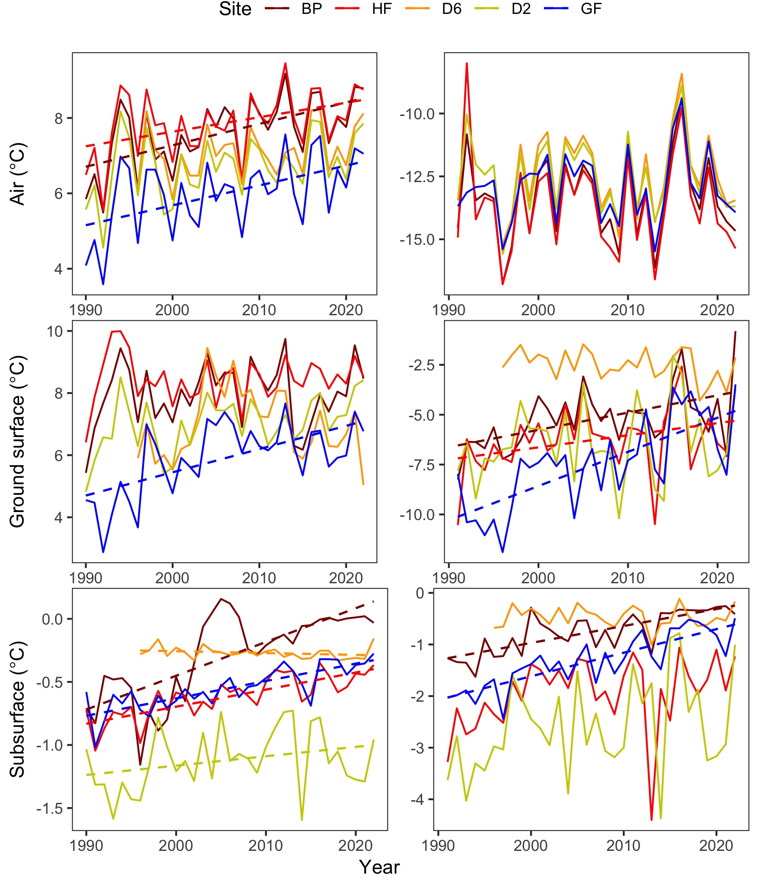
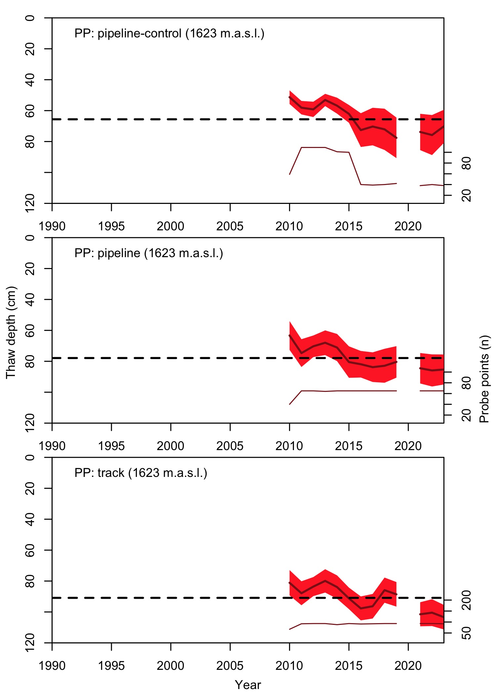

```{r setup, include=FALSE}
## This script is used to generate the NWT compendium each year

## Load libraries
library(bookdown)
library(tidyverse)
library(knitr)
library(officedown)
library(officer)
library(kableExtra)
library(flextable)
library(ftExtra)
library(formattable)

# opts_chunk$set(echo = FALSE)

```

```{r, include=FALSE}
## Define variables to be presented in the text
field_year <- 2023
ann_temp_increase <- 0.3
win_temp_increase <- 0.4
sum_win_perma_increase <- 0.3
low_thaw <- 4
high_thaw <- 24
```

## Long-term ecological and geomorphological investigations in the alpine tundra of the Mackenzie Mountains, NWT  

<br>

The goal of this project was to study recent permafrost thaw and evaluate limitations to treeline advance coincident with climate change in the western Mackenzie/eastern Selwyn Mountains. Annual air temperatures at our 5 weather stations have warmed by `r ann_temp_increase`°C per decade since 1990, with warming occurring faster during winter (`r win_temp_increase`°C per decade). The 1990–`r field_year` weather record from the 5 weather stations shows an increase of about `r sum_win_perma_increase`°C in both summer and winter permafrost temperatures. Warming appears to have accelerated permafrost thaw, with increases varying from `r low_thaw` centimetres per decade in low elevation sites, to greater than `r high_thaw` centimetres per decade at high elevations. Wetter areas and permafrost features with shrub cover were prone to thicker depths of thaw, though the latter had slower increases in thaw rates through time. As temperatures rise and permafrost thaws, Arctic landscapes will change, sometimes abruptly, and the current plant and animal residents may find themselves unable to adapt. The treeline was the other major focus of this research. Warmer temperatures could mean that more trees can grow farther north or further upslope in mountainous areas. In 2016–2019, the researcher planted tree seeds in some areas to see if they would grow. Surveys of these seeds in `r field_year` suggest that south-facing alpine slopes may be ideal environments for new trees to establish. However, there appear to be three apparent limitations to treeline expansion: 1) existing trees along the Canol Trail do not currently produce enough good seed to colonize new areas, 2) seeds in shrubby areas are quickly predated by small mammals, and 3) young tree seedlings are outcompeted by other vegetation before they can grow into adult trees. Cages placed over the planted seeds at treeline indicated seeds would be mostly devoured by animals if not protected by the cages, limiting treeline advance. Further monitoring is necessary to determine if current patterns of tree growth and permafrost thaw will continue into the foreseeable future.  

`r run_pagebreak()`

```{r, echo=FALSE,  fig.cap=paste("Figure 1. Some of the Mackenzie Mountains Earthwatch crew in August", field_year, "representing nine people from the United States and South Africa. Photo credit: Harvey Trop."), out.width="15cm"}

```

`r run_pagebreak()`

```{r, echo=FALSE,  fig.cap="Figure 2. Oblique photos of each of the permafrost monitoring sites. Photo credits: Steven Mamet.", out.width="12cm"}

```

`r run_pagebreak()`

```{r, echo=FALSE,  fig.cap="Figure 3. Aerial photos of each of the permafrost monitoring sites. People or weather stations are noted for scale. R.O.W. = right-of-way. Photo credits: Steven Mamet.", out.width="15cm"}
knitr::include_graphics("SitePics_2019.jpg")
```

`r run_pagebreak()`

```{r, echo=FALSE,  fig.cap="Figure 4. Temperatures in the air (top), ground surface (middle), and permafrost (bottom) during summer (June–September; left panels) and winter (October–May; right panels). Dashed lines are regression lines denoting significant temperature changes at a site.", out.width="13cm"}

```

`r run_pagebreak()`

```{r, echo=FALSE,  fig.cap=paste("Figure 5. The maximum depth of ground thaw (active layer depth), culminating in late summer, recorded through frost-probing the ground each August during 1990–", field_year, " period. The coloured regions around each time-series represent site variability (90% confidence intervals). Dashed lines are regression lines denoting significant thaw at a site presented with annual rates of permafrost thaw (cm/yr). Sampling did not occur in 2020, so there is a gap between the main record and 2021-", field_year, ". The number of probe points are indicated by the lower thin line in each plot. More probe points were added in 2011 and others were periodically lost due to loss of ice rich permafrost and pond formation around palsa perimeters. Two-letter site codes and elevations are given for each panel.", sep = ""), out.width="15cm"}

```

`r run_pagebreak()`

```{r, echo=FALSE,  fig.cap=paste("Figure 6. (left) Aerial photo from August 2019 of a permafrost peat plateau over which the Canol pipeline was laid during the early 1940s. Notice disturbances like vehicle tracks and thaw subsidence from the pipeline itself are still visible. (right) Thaw probe grid and mean thaw depth (1990–", field_year, ") interpolation overlain over the aerial photo. Note thaw depths are deeper in low-lying wet areas where soil moisture promotes heat penetration into the permafrost.", sep = ""), out.width="15cm"}
knitr::include_graphics("PipelinePlateau_2021.jpg")
```

`r run_pagebreak()`

```{r, echo=FALSE,  fig.cap=paste("Figure 7. The maximum depth of ground thaw (active layer depth), culminating in late summer, recorded through frost-probing the ground each August during 1990–", field_year, " period. The coloured regions around each time-series represent site variability (90% confidence intervals). Dashed lines are regression lines denoting significant thaw at a site presented with annual rates of permafrost thaw (cm/yr). Sampling did not occur in 2020, so there is a gap between the main record and 2021-", field_year, ". The number of probe points are indicated by the lower thin line in each plot. Thaw depths in disturbed areas are greater, though increase in thaw through time is greatest in undisturbed areas.", sep = ""), out.width="11cm"}

```

`r run_pagebreak()`

```{r, echo=FALSE, fig.cap="Figure 8. Oblique photos of the four treeline monitoring sites.", out.width="8cm"}
knitr::include_graphics("GTREEpics_2019.jpg")
```

`r run_pagebreak()`

```{r, echo=FALSE,  fig.cap=paste("Figure 9. Box-and-whisker plots of germination success as part of a fir seed-, substrate-, and seed-eater-manipulation experiment in 2017–", field_year, ". Red represents plots unprotected by mesh cages that protect seeds from seed-eating animals; blue indicates plots protected from seed-eaters. The lower and upper limits of the “box” consist of the 25^th^ and 75^th^ percentiles. The thick black line indicates the median. The “whiskers” illustrate the 5^th^ and 95^th^ percentiles. Raw data are presented as small, grey filled circles. Any values outside of the 5^th^ and 95^th^ percentiles are considered outliers and are indicated by (○). Draped lines indicate significant differences between substrate (upper horizontal lines) and cages (lower horizontal lines). ., `*`, `**`, `***` indicates _P_ < 0.1, _P_ < 0.05, _P_ < 0.01, and _P_ < 0.001 significance, respectively. a) the north-facing alpine near Dechen la’ lodge, b) the south-facing alpine, c) within treeline near Boulder Creek with shrubs removed, and d) within shrub-treeline near Boulder Creek. Treatments of plots (50 x 50 cm) consisted of: 1. Control = no manipulations: used to assess natural seedling establishment (unseeded vegetated). 2. Seeded = plots were seeded with 20 fir seeds of known viability (65%; seeded vegetated). 3. Scarified = ground vegetation was removed to simulate disturbance (unseeded scarified). 4. Scarified and seeded = ground vegetation was removed, and 20 seeds of each species were planted on the plot (seeded scarified).", sep = ""), out.width="11cm"}

```

`r run_pagebreak()`

```{r, echo=FALSE,  fig.cap=paste("Figure 10. Box-and-whisker plots of germination success as part of a spruce seed-, substrate-, and seed-eater-manipulation experiment in 2017–", field_year, ". Red represents plots unprotected by mesh cages that protect seeds from seed-eating animals; blue indicates plots protected from seed-eaters. The lower and upper limits of the “box” consist of the 25^th^ and 75^th^ percentiles. The thick black line indicates the median. The “whiskers” illustrate the 5^th^ and 95^th^ percentiles. Raw data are presented as small, grey filled circles. Any values outside of the 5^th^ and 95^th^ percentiles are considered outliers and are indicated by (○). Draped lines indicate significant differences between substrate (upper horizontal lines) and cages (lower horizontal lines). ., `*`, `**`, `***` indicates _P_ < 0.1, _P_ < 0.05, _P_ < 0.01, and _P_ < 0.001 significance, respectively. (a) the north-facing alpine near Dechen la’ lodge, b) the south-facing alpine, c) within treeline near Boulder Creek with shrubs removed, and d) within shrub-treeline near Boulder Creek. Treatments of plots (50 x 50 cm) consisted of: 1. Control = no manipulations: used to assess natural seedling establishment (unseeded vegetated). 2. Seeded = plots were seeded with 20 spruce seeds of known viability (65%; seeded vegetated). 3. Scarified = ground vegetation was removed to simulate disturbance (unseeded scarified). 4. Scarified and seeded = ground vegetation was removed, and 20 seeds of each species were planted on the plot (seeded scarified).", sep = ""), out.width="11cm"}

```

